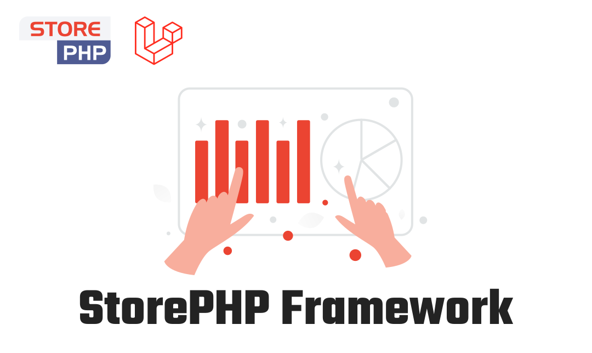

  
  

# Laravel eCommerce Framework

eCommerce framework to help you build and manage your eCommerce based on laravel.

## Documentation

You can find the detailed documentation here in [eCommerce Framework Documentation](#).

## Contributing

Thank you for considering contributing to this package! Be one of the StorePHP team.

## License

This package is an open-sourced software licensed under the [MIT license](https://opensource.org/licenses/MIT).
